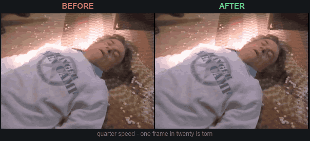

<div align="center">


# VHS Commercial Cutter

**Find the commercials in your digitized VHS tapes and save them as clips. Or flip it and keep the show instead, with the ads stripped out.**


[**Download the latest Windows release**](https://github.com/90sCraig/vhs-commercial-cutter/releases/latest)

Windows x64, tested on Windows 11. Installer and portable both available. FFmpeg is included.


</div>

---

## What it does

Digitize a stack of old tapes and you get hours of footage that is half show, half commercials. The ads are the part nobody archived, and the part worth digging out.

This looks for the fade-to-black and dead air that sit between the program and the ads, then cuts the tape into clips at those points. Keep the commercials as separate clips or one merged reel, or reverse it and keep the show with the ads gone.

Load a tape, check the cuts, export. It is not a video editor.

## Download & install

Grab the latest [release](https://github.com/90sCraig/vhs-commercial-cutter/releases/latest):

- **`…-Setup-<ver>.exe`** is the installer. Adds a Start-menu shortcut and an uninstaller.
- **`…-Portable-<ver>.exe`** is one exe, no install.

> It is not code-signed, so the first run trips Windows SmartScreen with an "unknown publisher" warning. Click **More info → Run anyway**.

## Sample output

One tape, every ad break pulled out and exported as a single file:

<div align="center">

[](https://youtu.be/vLCmeiwF9JU)

<sub>▶ [Late ’80s Cincinnati Commercials | WKRC Channel 12](https://youtu.be/vLCmeiwF9JU) on YouTube</sub>

</div>

## Repairing torn frames

Some capture devices lose sync a few times a second and write a frame split across two positions, with a band of corrupted data between. At full speed it reads as a stutter, so the instinct is to go hunting for a frame rate problem. It is not one. The timestamps are perfectly even, and nothing aimed at frame rate touches it.

<div align="center">



<sub>Slowed to a quarter speed. One frame in twenty is torn.</sub>

</div>

The repair rebuilds the broken frame from the two either side, which are undamaged. On the capture above that took 14 torn frames per 500 down to none. Every tape is checked when you open it, and the switch turns itself on if there is anything to fix.

This is a fault in the capture hardware, not the tape, so if one capture has it, everything from that setup probably does. Fix it at the source if you still can. The repair discards real frames, and a clean capture beats a patched one.

## Features

- **Finds the commercials on its own.** It lines up black frames with silent audio to spot the breaks. Turn the sensitivity up or down if it guesses wrong.
- **A timeline you can work in.** Zoom, drag the cut points, split and merge clips, set in and out, step frame by frame from the keyboard. There is a minimap for the wide view.
- **Scrubs fast on huge files.** It builds a small preview copy in the background so a giant MKV or a capture on your network still plays smooth. The cache is yours to control.
- **Clean-up tools.** Denoise and sharpen by tape speed, push brightness, contrast, saturation and gamma, fix the RGB balance, repair torn frames, and pull the audio back in sync when it drifts.
- **Exports how you want.** Commercials or show, merged or separate clips. Keep the source shape or reframe to 4:3, pick a quality, name the files yourself. Resolution and frame rate always follow your source. Cut points also export as CSV and an AviSynth `Trim()` chain for cutting elsewhere.
- **Uses your GPU where it helps.** NVIDIA, Intel or AMD encoding on export, picked on first run, falling back to the CPU by itself if a hardware path fails mid-job. Preview building and detection stay on the CPU by design, because offloading them measured slower.
- **Safe to walk away from.** A long export keeps the machine awake, stages files beside your output instead of filling the Windows drive, and checks for room before starting rather than dying an hour in. Anything long-running can be stopped mid-run.
- **Nothing else to install.** FFmpeg ships inside the app.
- **Updates when you say so.** It tells you a new version is out, then waits.

## How it compares

VideoReDo and Comskip are what people usually reach for. Both were built for the opposite job: taking commercials **out** of digital TV recordings. This keeps them, and expects an analog capture rather than a broadcast stream.

| | VHS Commercial Cutter | VideoReDo | Comskip |
|---|---|---|---|
| **Built for** | VHS and other analog captures | Digital TV recordings | Digital TV recordings |
| **What you get by default** | The commercials | The show | A list of where the ads are |
| **Finds breaks using** | Black frames and audio silence together | Manual editing, with ad detection to assist | Black frames, station logo, aspect ratio, scene rate, closed captions |
| **Interface** | Windows app | Windows app | Command line and a config file |
| **How it cuts** | Re-encodes | Smart render: copies what it can, re-encodes only at the cuts | Does not cut. Hands the list to another tool |
| **Cleans up the picture** | Denoise, sharpen, color, torn frames, audio drift | Not its purpose | Not its purpose |
| **Also exports** | Cut points as CSV and an AviSynth `Trim()` chain | The edited file | EDL and many other cutlist formats |
| **Price** | Free, MIT | Paid | Free, GPL v2 |

Where the others win: VideoReDo's smart rendering copies the untouched parts of a file and re-encodes only at the cuts, so it is faster and lossless in between. This re-encodes everything, because VHS captures rarely have a keyframe where you want to cut. Its development stopped after the death of its founder, so it still works but will not gain new versions.

Comskip detects better wherever a station logo or closed captions exist, and it runs unattended. Old analog captures usually have neither: most pre-90s broadcasts carry no logo bug, and consumer capture hardware drops the line 21 captions even though the tape holds them. That gap is what this fills.

Any of the three gets you the show without the ads. This one exists because the other two throw the commercials away.

## Local processing

Your video stays on your computer. Detection, preview building and export all run locally through the bundled FFmpeg. The only outbound connection is an update check against GitHub releases, and nothing downloads or installs without you saying yes.

## Quick start

1. **Open a tape.** Click *Open file…* or drag a video onto the player. MP4, MKV, AVI, MOV and most other things.
2. **Detect the commercials.** Hit *Detect commercials*. Clips appear on the timeline, green to keep, red to cut.
3. **Check its work.** Click a clip to play it. Flip keep/cut with a click or `K`. Drag the yellow edges, or `S` to split, `M` to merge, `I`/`O` to set in and out.
4. **Pick what you're making.** Commercials or the show, as one merged file or separate clips.
5. **Export.** Choose a folder and go. It always cuts from your original at full quality. Detection scans the small preview copy instead, which is much faster and finds the same breaks.

<div align="center">


<sub>The **Guide** walks through all of this.</sub>


<sub>**Settings** handles the preview cache, the CPU/GPU encoder, and updates.</sub>

</div>

## Troubleshooting

**It missed commercials.** Raise **Black sensitivity** in Detect and run it again, which makes it treat darker, not-quite-black frames as boundaries. If the audio between segments is not truly silent, raise **Silence threshold** too. Some tapes have no clean transitions at all, in which case add cuts by hand with `S`.

**It found too many cuts.** Lower those same two sliders. Dark scenes and quiet passages look a lot like commercial breaks. **Min commercial gap** ignores boundary gaps shorter than its value, which helps on noisy tapes.

**Segments are whole ad breaks, not single ads.** That is the detector working as designed. It splits where it finds black and silence, and how finely that lands depends on the tape. Use `S` to split a pod into individual spots.

**The picture stutters, and it is not the playback.** If it stutters the same way in the exported file, the capture is probably tearing. See [Repairing torn frames](#repairing-torn-frames).

**Playback is choppy.** Wait for the preview copy to finish building. The badge at the top-left of the player shows progress. Big captures and files on a network drive will not scrub smoothly until it is ready, and you can cancel it and play the original instead.

**Export failed.** It checks free space before starting and will tell you if there is not room, so start there. Hardware encoder failures fall back to the CPU on their own. If it keeps failing, set the encoder to CPU in Settings.

## What it isn't

This is the last step, not the whole pipeline. It assumes your capture is finished. It will not deinterlace, fix field order, or straighten a stretched aspect ratio, and it does no capture-side work at all. Everyone's chain is different, and a wrong guess at that stage bakes into the file for good. Use the tools built for it.

It handles the light stuff at the end: denoise and sharpen a little, nudge the color, even out the volume. Final polish, not technical video work.

## Project status

I built this with AI for my own VHS workflow. It works on the captures and hardware I have tested, but other setups will find bugs I have not.

Report bugs, request features, or contribute fixes through [GitHub issues](https://github.com/90sCraig/vhs-commercial-cutter/issues). That is the only place I am tracking them.

## Made by 90s Craig

I'm a VHS archivist in Columbus, Ohio. I find old tapes, digitize them live on stream, and archive whatever turns up. I built this because cutting the commercials out by hand got old.

- 🌐 **Site**: [90scraig.com](https://90scraig.com)
- ▶ **YouTube**: [@90sCraig](https://www.youtube.com/@90sCraig)
- 📸 **Instagram**: [@90s_craig](https://www.instagram.com/90s_craig/)
- 🟣 **Twitch**: [90s_craig](https://www.twitch.tv/90s_craig)
- 🦋 **Bluesky**: [@90scraig.com](https://bsky.app/profile/90scraig.com)

## Building from source

FFmpeg and FFprobe are pulled in during `npm install` (through `ffmpeg-static` / `ffprobe-static`) and bundled into the build, so nobody downloading the app needs them.

```powershell
npm install   # also grabs the bundled FFmpeg binaries
npm start     # run it in dev
npm run dist  # build installer + portable into dist\
npm run pack  # unpacked app only (dist\win-unpacked)
```

## Releasing an update

The installed app checks GitHub releases on launch and tells the user when a new version is out. Nothing installs without them saying yes. To put one out:

```powershell
npm run release -- patch   # 0.2.1 → 0.2.2: bump, build, publish
npm run release -- minor   # 0.2.1 → 0.3.0
npm run release            # release the current version as-is
```

You'll need the GitHub CLI (`gh auth login`).

## Tech

Electron, FFmpeg (bundled), electron-builder. No native modules. The app drives FFmpeg as a subprocess.

## License

[MIT](LICENSE). Bundles FFmpeg (GPL v3, run as a separate process). See [THIRD-PARTY-NOTICES.md](THIRD-PARTY-NOTICES.md).
