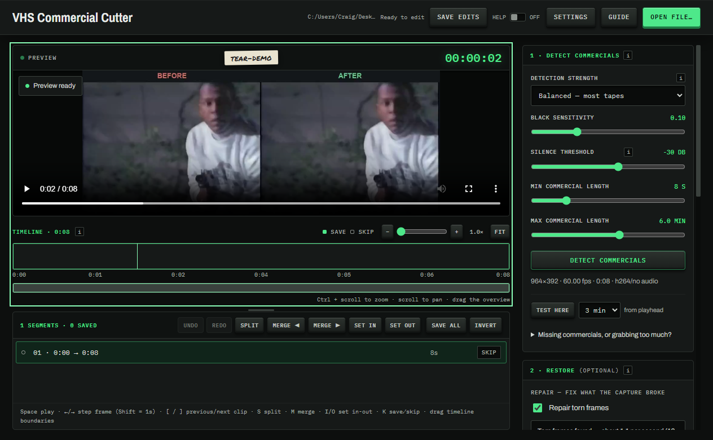
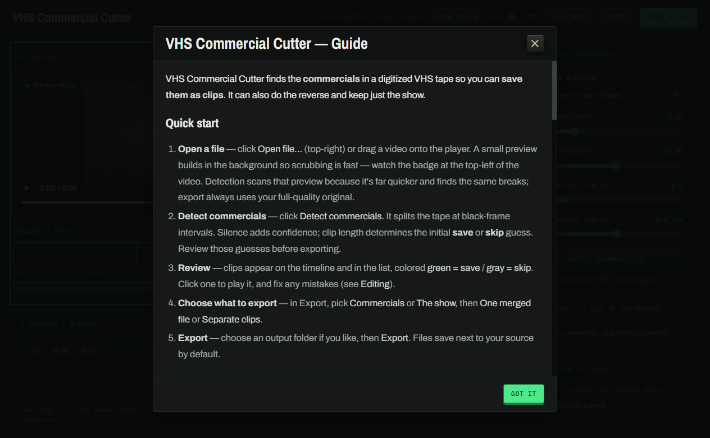
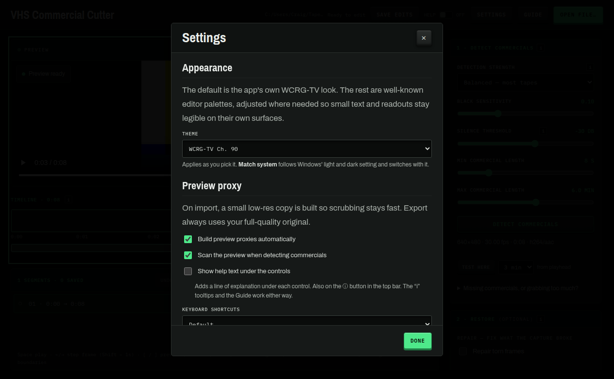

<div align="center">


# VHS Commercial Cutter

**Cut the commercials out of your digitized VHS tapes. Keep the show as one clean file, or turn the ads into vertical clips for TikTok and Reels.**




</div>

---

## What it does

You digitize a stack of old tapes and end up with hours of footage that's half show, half commercials. This finds the commercials for you.

It looks for the fade-to-black and the dead-air that sit between the program and the ads, cuts the tape into clips at those spots, and then hands you the wheel:

- 📺 **Keep the show.** Export the program with the commercials pulled out, as one file.
- 🎬 **Keep the commercials.** Those old ads are half the reason to save a tape. Reframe them to vertical 9:16 with a blurred background and post them.

It's not a full video editor and doesn't pretend to be. Load a tape, check the cuts, export.

## Features

- **Finds the commercials on its own.** It lines up black frames with silent audio to spot the breaks. If it's guessing wrong, turn the sensitivity up or down.
- **A timeline you can actually work in.** Zoom in, drag the cut points, split and merge clips, set in and out, step through frame by frame from the keyboard. There's a minimap for the wide view.
- **Scrubs fast on huge files.** It builds a small proxy in the background so a giant MKV or a capture sitting on your network still plays smooth. The proxy cache is yours to control.
- **Clean-up tools.** Denoise and sharpen by tape speed, push brightness, contrast, saturation, and gamma, fix the RGB balance, and pull the audio back in sync when it drifts.
- **Exports how you want.** Keep the source shape or reframe to vertical, portrait, or square. Pick your quality, resolution, and frame rate, name the files yourself, or just hit the **Clean tape** or **Social clips** preset and go.
- **Uses your GPU if you've got one.** NVIDIA, Intel, or AMD for encode and decode, on export, previews, and detection. Falls back to the CPU (x264) on its own when the hardware path isn't there, or if it gives out partway through a job.
- **Safe to walk away from.** A long export keeps the machine awake, works next to your output folder instead of quietly filling the Windows drive, and tells you up front if there isn't room rather than dying an hour in.
- **Nothing else to install.** FFmpeg ships inside the app.
- **Updates when you say so.** It tells you a new version is out and then waits. Nothing installs behind your back.

## Download & install

Grab the latest [release](https://github.com/90sCraig/vhs-commercial-cutter/releases/latest):

- **`…-Setup-<ver>.exe`** — the installer. Adds a Start-menu shortcut and an uninstaller.
- **`…-Portable-<ver>.exe`** — one exe, no install.

> It's not code-signed, so the first time you run it Windows SmartScreen throws an "unknown publisher" warning. Click **More info → Run anyway**. Windows x64 only.

## Quick start

1. **Open a tape.** Click *Open capture…* or drag a video onto the player. MP4, MKV, AVI, MOV, and most other things.
2. **Detect the commercials.** Hit *Detect commercials*. Clips show up on the timeline, **green to keep**, **red to cut**.
3. **Check its work.** Click a clip to play it. Flip keep/cut with a click or `K`. Drag the yellow edges, or `S` to split, `M` to merge, `I`/`O` to set in and out.
4. **Pick what you're making.** **📺 Clean tape** or **🎬 Social clips**.
5. **Export.** Choose a folder and go. It always cuts from your original file at full quality; the proxy is only there to keep things quick while you work.

<div align="center">

&nbsp;&nbsp;

</div>

<sub>The **Guide** on the left walks through all of this. **Settings** on the right handles the proxy cache, the CPU/GPU encoder, and updates.</sub>

## Made by 90s Craig

I'm a VHS archivist in Columbus, Ohio. I find old tapes, digitize them live on stream, and archive whatever turns up. I built this because cutting the commercials out by hand got old.

- 🌐 **Site** — [90scraig.com](https://90scraig.com)
- ▶️ **YouTube** — [@90sCraig](https://www.youtube.com/@90sCraig)
- 📸 **Instagram** — [@90s_craig](https://www.instagram.com/90s_craig/)
- 🟣 **Twitch** — [90s_craig](https://www.twitch.tv/90s_craig)
- 🦋 **Bluesky** — [@90scraig.com](https://bsky.app/profile/90scraig.com)

## Building from source

FFmpeg and FFprobe get pulled in during `npm install` (through `ffmpeg-static` / `ffprobe-static`) and bundled into the build, so nobody downloading the app needs them.

```powershell
npm install   # also grabs the bundled FFmpeg binaries
npm start     # run it in dev
npm run dist  # build installer + portable into dist\
npm run pack  # unpacked app only (dist\win-unpacked)
```

## Releasing an update

The installed app checks GitHub releases when it launches and lets the user know when a new version is out. Nothing installs without them saying yes. To put one out:

```powershell
npm run release -- patch   # 0.1.0 → 0.1.1: bump, build, publish
npm run release -- minor   # 0.1.0 → 0.2.0
npm run release            # release the current version as-is
```

You'll need the GitHub CLI (`gh auth login`). One catch: **auto-update only works once the repo is public.** While it's private, the release files need authentication to download, so users can't pull them.

## Tech

Electron, FFmpeg (bundled), electron-builder. No native modules. The app just drives FFmpeg as a subprocess.

## License

[MIT](LICENSE). Bundles FFmpeg (LGPL/GPL, run as a separate process). See [THIRD-PARTY-NOTICES.md](THIRD-PARTY-NOTICES.md).
